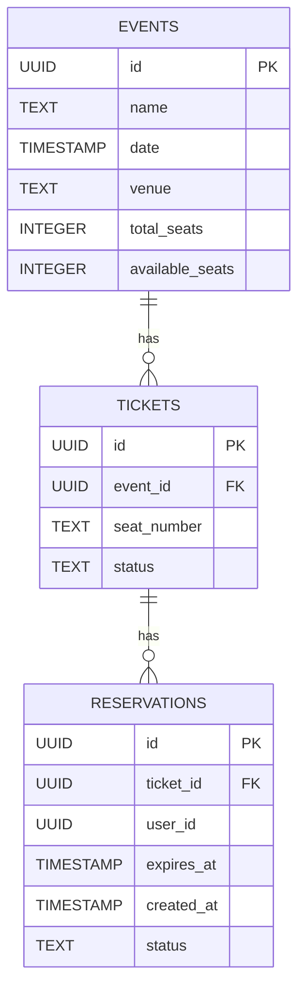
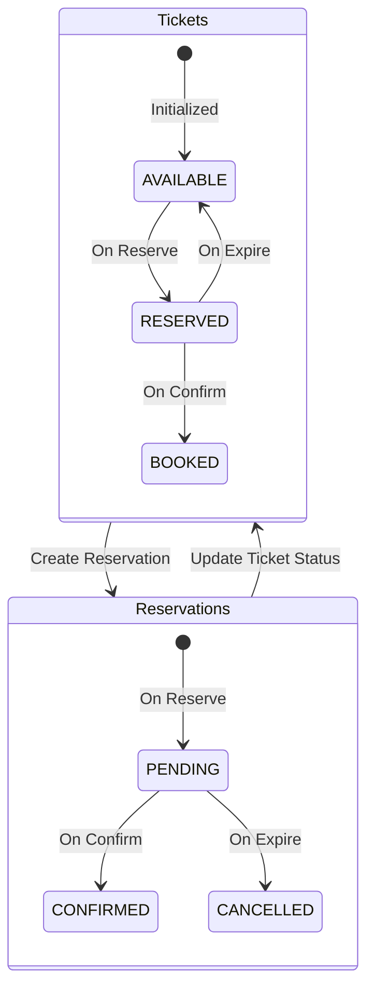

# Entities

```mermaid
erDiagram
    EVENTS {
        UUID id PK
        TEXT name
        TIMESTAMP date
        TEXT venue
        INTEGER total_seats
        INTEGER available_seats
    }

    TICKETS {
        UUID id PK
        UUID event_id FK
        TEXT seat_number
        TEXT status
    }

    RESERVATIONS {
        UUID id PK
        UUID ticket_id FK
        UUID user_id
        TIMESTAMP expires_at
        TIMESTAMP created_at
        TEXT status
    }

    EVENTS ||--o{ TICKETS : has
    TICKETS ||--o{ RESERVATIONS : has

```

# State transitions

```mermaid
stateDiagram-v2
    state "Tickets" as T {
        [*] --> AVAILABLE: Initialized
        AVAILABLE --> RESERVED: On Reserve
        RESERVED --> AVAILABLE: On Expire
        RESERVED --> BOOKED: On Confirm
    }

    state "Reservations" as R {
        [*] --> PENDING: On Reserve
        PENDING --> CONFIRMED: On Confirm
        PENDING --> CANCELLED: On Expire
    }

    T --> R: Create Reservation
    R --> T: Update Ticket Status

```